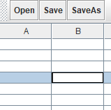

# CSV Editor使用说明

`3150104714 任皓天`

## 界面

使用`java -jar CSVEditor.jar`命令即可打开CSV编辑器。

打开后的界面如下图所示：

编辑器界面可以通过鼠标进行缩放，其界面分为两个部分：

- 工具栏

  

  工具栏从左至右分为三部分，分别为：

  - 文件操作，包括打开文件、保存文件以及另存为操作
  - 表格操作，包括添加行列以及删除行列操作
  - 关于（About），显示本编辑器的相关信息

- 表格区

  

  使用表格的方式进行CSV文件的表示，每一个单元格即表示两个逗号之间的一个元素，可以使用右方以及下方的拖动条进行表格各处内容的查看。

  ​

## 操作

### 文件操作

- 打开文件

  文件的打开采用文件选择对话框的方式进行：

  

  通过对话框，可以进行CSV文件的选择，也可以查看所有文件，打开非`.csv`格式的文件：

  

  打开文件时有可能出现两种错误：

  - 所指定文件不存在

    

  - 所指定文件无法使用csv格式进行读取

    

  当正常打开文件后，窗体标题会进行改变，以一个空文件`demo.csv`为例：

  

- 保存文件

  将`demo.csv`编辑如下：

  

  进行保存，查看文件，可以看到文件已经进行了更改：

  

  需要特殊说明的是，当之前并未进行打开文件操作而直接在初始表格上进行修改时，点击保存将使用另存为的方式进行。

- 另存为文件

  

  另存为后，桌面位置多出`demo1.csv`，且编辑器标题也已发生更改：

  

  保存文件以及另存为文件有可能发生写文件错误，如我们将`demo1.csv`设置为只读文件，再次进行保存，会出现如下提示：

  

  此外对于保存操作需要说明的是，在任何时刻若表格区存在未保存的修改，执行打开新文件或者退出操作时会收到如下提示：

  

  点击“是”则进行保存，点击“否”不保存并进行原本所执行操作，点击“取消”则不保存且中止原本所执行操作。

### 表格操作

对于表格的修改可以采用以下两种方式进行：

- 单元格操作

  在想要进行修改的单元格上进行双击或者在单元格选中的情况下直接进行输入，所选中的单元格便进入可编辑状态，如下图所示：

  

  当单元格进入编辑状态后便可以在其中进行正常的文字操作：

  

  当修改结束时，在表格区的其他部分（拖动条除外）进行单击，所修改单元格便退出编辑状态，到此该单元格的内容修改完成：

  

- 行列操作

  使用工具栏的第二部分可以进行行列操作，当有单元格选中时对当前行列进行操作，当无单元格选中时默认对于最后一行、最后一列进行操作。

  以一个空CSV文件为例进行说明：

  

  添加一行一列后如下：

  

  如下填入数据后，选中写入”1“的单元格，执行一次删除列操作、一次删除行操作后，结果如下图所示：

  

  此外，对于列，我们可以使用鼠标单击列头位置对列进行左右移动，如下图所示：

  

  移动完成后如下：

  

## 关于

